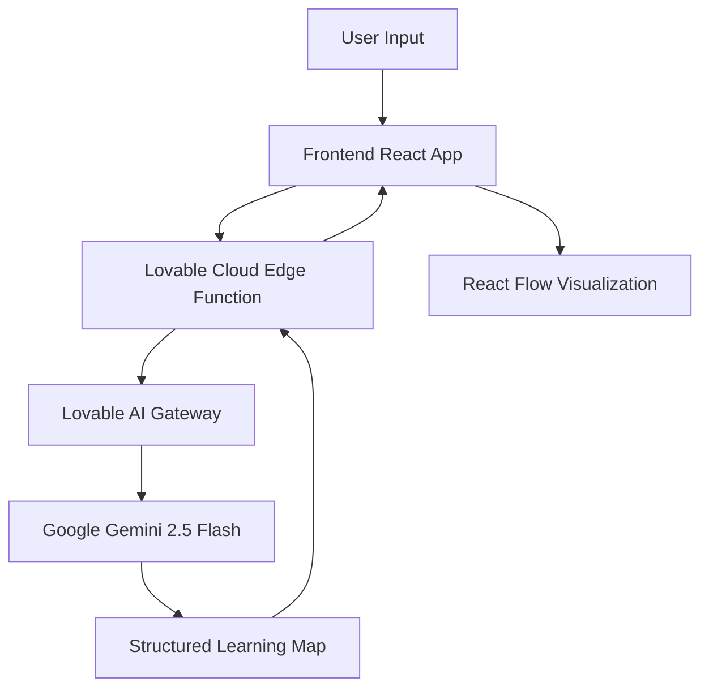

# AI Learning Map Generator

An intelligent web application that generates interactive, visual learning maps for any topic using AI. Transform your learning goals into structured, guided journeys with curated resources and hierarchical knowledge graphs.

## 🚀 Features

- **AI-Powered Map Generation**: Uses Google Gemini 2.5 Flash to create comprehensive learning roadmaps
- **Interactive Visualization**: Built with React Flow for smooth, interactive node-based graphs
- **Hierarchical Structure**: Organizes topics into main areas → subtopics with clear relationships
- **Learning Resources**: Each node includes curated articles, videos, courses, and books
- **Difficulty Levels**: Adjust content complexity (Beginner, Intermediate, Advanced)
- **Export Functionality**: Download your learning maps as JSON for future reference
- **Responsive Design**: Works beautifully on desktop and mobile devices

## 🛠️ Tech Stack

### Frontend
- **React 18** with TypeScript
- **Vite** for blazing-fast development
- **Tailwind CSS** for styling with custom design system
- **React Flow (@xyflow/react)** for interactive node visualizations
- **Shadcn UI** for beautiful, accessible components
- **TanStack Query** for data fetching

### Backend
- **Lovable Cloud** (Supabase-powered backend)
- **Edge Functions** (Deno) for serverless AI integration
- **Lovable AI Gateway** for seamless LLM access

## 📦 Installation & Setup

### Prerequisites
- Node.js 18+ and npm
- A Lovable account (for backend services)

### Local Development

1. **Clone the repository**
```bash
git clone <your-repo-url>
cd ai-learning-map
```

2. **Install dependencies**
```bash
npm install
```

3. **Set up environment variables**
The `.env` file is auto-generated when you enable Lovable Cloud. It includes:
- `VITE_SUPABASE_URL`
- `VITE_SUPABASE_PUBLISHABLE_KEY`
- `VITE_SUPABASE_PROJECT_ID`

4. **Run the development server**
```bash
npm run dev
```

The app will be available at `http://localhost:8080`

## 🌐 Deployment

### Deploy to Lovable
1. Click the "Publish" button in the Lovable editor
2. Your app will be live at `yourapp.lovable.app`

### Deploy to Vercel/Netlify
1. Connect your GitHub repository
2. Configure build settings:
   - **Build Command**: `npm run build`
   - **Output Directory**: `dist`
3. Add environment variables from your `.env` file
4. Deploy!

## 🧠 How It Works

### Architecture Overview



### Data Flow

1. **User submits a topic** (e.g., "Web Development") with a difficulty level
2. **Frontend calls Edge Function** via Supabase client
3. **Edge Function constructs prompt** with structured output requirements
4. **Lovable AI Gateway** routes request to Google Gemini 2.5 Flash
5. **AI generates learning map** using tool calling for structured data
6. **Backend validates and returns** JSON learning map structure
7. **Frontend transforms data** into React Flow nodes and edges
8. **User interacts** with the visual map, exploring topics and resources

### AI Integration

The app uses **Lovable AI** with structured output via tool calling:

```typescript
{
  model: "google/gemini-2.5-flash",
  messages: [...],
  tools: [{
    type: "function",
    function: {
      name: "create_learning_map",
      parameters: {
        topic: string,
        description: string,
        mainAreas: Array<{
          title, description, resources, subtopics
        }>
      }
    }
  }],
  tool_choice: { type: "function", function: { name: "create_learning_map" } }
}
```

## 🎨 Design System

The app uses a custom design system with semantic tokens:

- **Primary Color**: Teal (`hsl(180 85% 45%)`) - representing knowledge and growth
- **Accent Color**: Cyan-green (`hsl(165 75% 55%)`)
- **Gradients**: `--gradient-primary`, `--gradient-hero`
- **Shadows**: Layered with primary color tints
- **Transitions**: Smooth cubic-bezier animations

All colors use HSL format for easy theming and support both light and dark modes.

## 📁 Project Structure

```
ai-learning-map/
├── src/
│   ├── components/
│   │   ├── LearningMapGenerator.tsx    # Input form component
│   │   ├── LearningMapVisualization.tsx # React Flow map
│   │   └── ui/                          # Shadcn components
│   ├── pages/
│   │   └── Index.tsx                    # Main page
│   ├── integrations/
│   │   └── supabase/                    # Auto-generated Supabase client
│   ├── index.css                        # Design system tokens
│   └── App.tsx
├── supabase/
│   ├── functions/
│   │   └── generate-learning-map/
│   │       └── index.ts                 # Edge function for AI calls
│   └── config.toml                      # Supabase configuration
├── public/
└── package.json
```

## 🔑 API & Environment Variables

### Lovable AI Gateway
- **Endpoint**: `https://ai.gateway.lovable.dev/v1/chat/completions`
- **Authentication**: `LOVABLE_API_KEY` (auto-provisioned in Lovable Cloud)
- **Model**: `google/gemini-2.5-flash`

### Rate Limits
- Lovable AI has workspace-level rate limits
- 429 errors are handled gracefully with user notifications
- 402 errors indicate credit exhaustion

## 🧪 Testing & Debugging

### View Edge Function Logs
Edge functions are deployed automatically. To debug:
1. Check the browser console for client-side errors
2. View edge function logs in Lovable Cloud → Functions

### Common Issues

**Issue**: "No data received from the function"
- **Solution**: Check edge function logs for errors, ensure AI gateway is responding

**Issue**: Map doesn't render
- **Solution**: Verify data structure matches expected schema, check browser console

**Issue**: Rate limit errors
- **Solution**: Add credits in Settings → Workspace → Usage

## 🚧 Trade-offs & Design Decisions

### Why React Flow?
- **Pros**: Excellent performance, built-in controls, customizable nodes
- **Cons**: Learning curve, bundle size (~100KB)
- **Alternative considered**: D3.js (more control but steeper learning curve)

### Why Lovable AI instead of direct OpenAI?
- **Pros**: No API key management, pre-configured, cost-effective
- **Cons**: Limited to supported models
- **Trade-off**: Simplified setup vs. flexibility

### Why Edge Functions over client-side API calls?
- **Pros**: Secure API key handling, rate limiting, error handling
- **Cons**: Additional latency from backend hop
- **Trade-off**: Security and control vs. speed

### Data Structure
The learning map uses a **tree structure** rather than a graph to simplify:
- AI generation (hierarchical is easier to prompt)
- Visualization layout (radial tree layout)
- User understanding (clear parent-child relationships)

**Trade-off**: Can't represent cross-connections between topics, but provides clearer learning paths.

## 🎯 Future Enhancements

- [ ] Save learning maps to database for persistence
- [ ] User authentication for personalized maps
- [ ] Share learning maps via public URLs
- [ ] Add progress tracking (mark completed topics)
- [ ] Community-curated resource recommendations
- [ ] Multi-language support
- [ ] Mobile app version
- [ ] AI-powered learning path suggestions based on user history

## 📄 License

This project is built with Lovable and is open source under the MIT License.

## 🤝 Contributing

Contributions are welcome! Please open an issue or submit a pull request.

## 📞 Support

For questions or issues:
- Open a GitHub issue
- Contact via Lovable community Discord

---

**Built with ❤️ using Lovable, React, and AI**